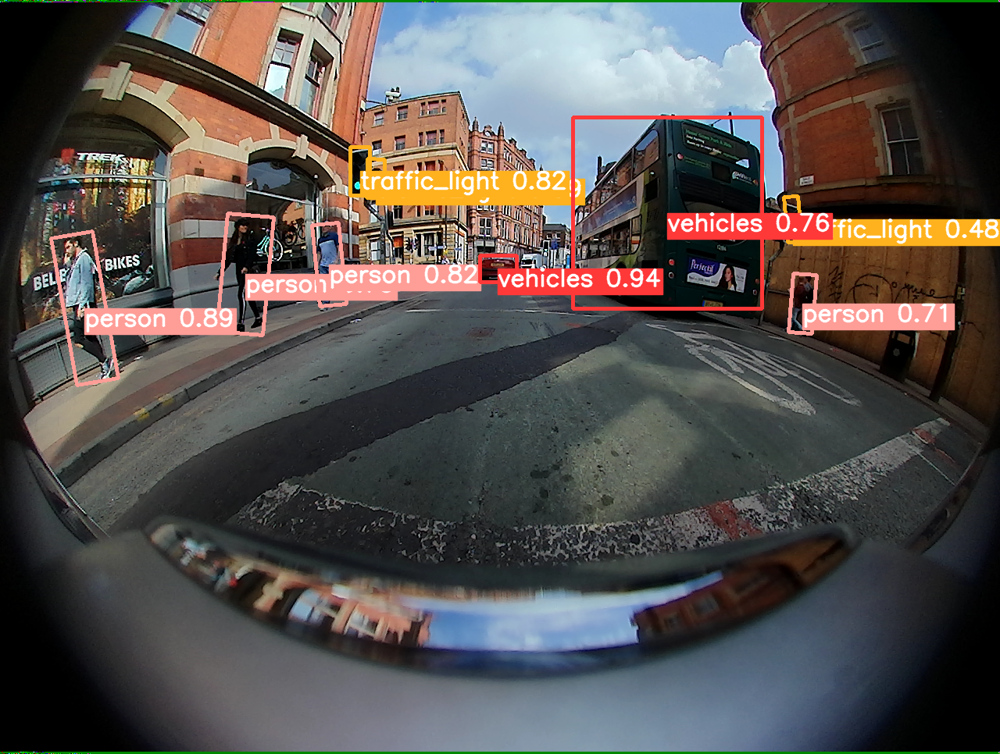
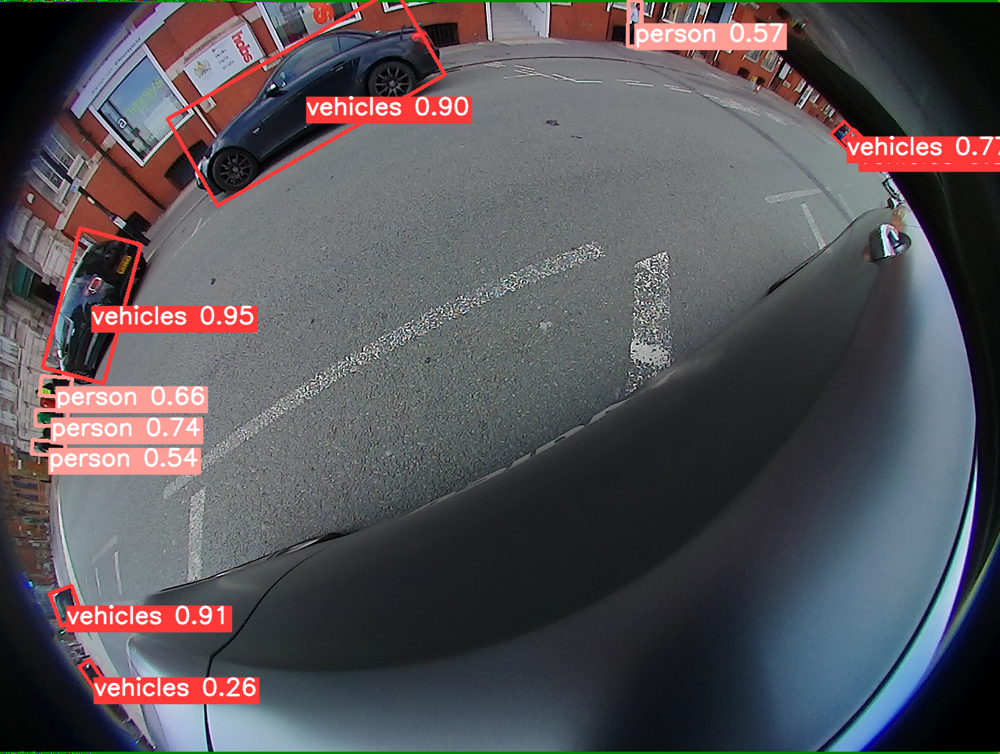
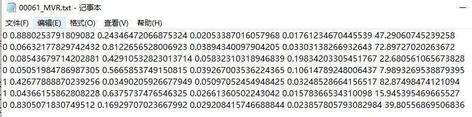
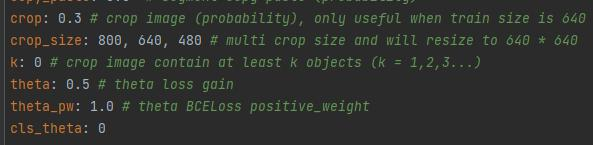
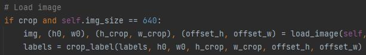
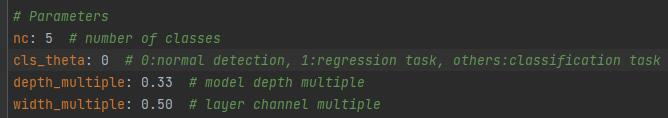
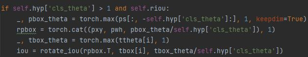
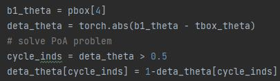
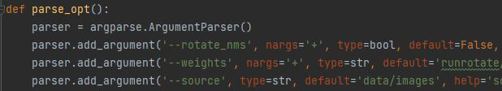

## 基于WoodScape数据集的旋转框目标检测

硕士毕业论文代码，也是小论文的代码。开个源吧，做的一般，我就混个毕业的，毕竟我是机械专业。
本来想着是学算法跑路去大厂，结果发现非科班的没顶会实习都找不到，呜呜呜...不说了，准备进厂打螺丝了。

------

检测结果展示：

### 标签格式

用Opencv法表示标签，即（x, y, w, h, angle），之所以这么表示，是因为从语义标签生成(调用的opencv库)的旋转框就是这种形式，
而且标注自己的数据集时用到的旋转框的标注工具[rolabelimg](https://github.com/cgvict/roLabelImg)生成的也是这种格式（
用这个标的时候角度统一往右边旋转，就是按v，生成的xml再转yolo就行了，具体看xml2yolo_rotate.py这个文件）。标签加载的时候自己会转为长短边表示。

### 新增功能1：随机裁剪加多尺度数据增强
yolov5没有裁剪的数据增强方法，所以我就想自己加上去好了，因为它对小目标的检测效果好。
参考mmdetecion的代码更改([链接](https://github.com/open-mmlab/mmocr/blob/main/mmocr/datasets/transforms/ocr_transforms.py)),
裁剪的尺度必须小于图像宽高最小值，并且以640尺度训练才能使用哈，裁剪的图至少包含k个目标，k设置较大时crop设置为1（代码特性）

更改的是dataset.py中load img这个地方

### 新增功能2：旋转框检测

需要设置角度的分类数cls_theta实现旋转框检测，越小越粗糙，比如36就是以5度为一类。注意！
超参文件的cls_theta也要设置一样的角度（代码特性）。 
cls_theta取0为水平框，加载的标签也必须是水平框的标签，实现的是原始yolov5的功能；
取1的话是基于回归任务的旋转框检测（效果不好，不建议用），大于1就是分类任务的旋转框检测。

### 新增功能3：IOU损失优化

在CIOU的基础上增加角度惩罚项，加快收敛并提高回归精度。
在loss.py中ComputeLoss这个地方做了更改

### 新增功能4：rotate_nms（有问题）

没有bug，但结果就是抑制不了，代码没找到错误，烦死了，算了，大神们自己改吧，
感觉影响也不大。

### 参考代码
* [hukaixuan19970627/yolov5_obb](https://github.com/hukaixuan19970627/yolov5_obb)
* [BossZard/rotation-yolov5](https://github.com/BossZard/rotation-yolov5)
* [ultralytics/yolov5](https://github.com/ultralytics/yolov5)
* [valeoai/WoodScape](https://github.com/valeoai/WoodScape)

### 后续更新

- 已更新标签相关工具scripts
- 初步实现多任务网络，后面更新

### 运行环境

* GPU RTX3090
* ubuntu 20.04.1
* cuda == 11.3
* python == 3.8.13 
* pytorch == 1.10.1 
* transformers==4.21.1   
* numpy==1.22.4
