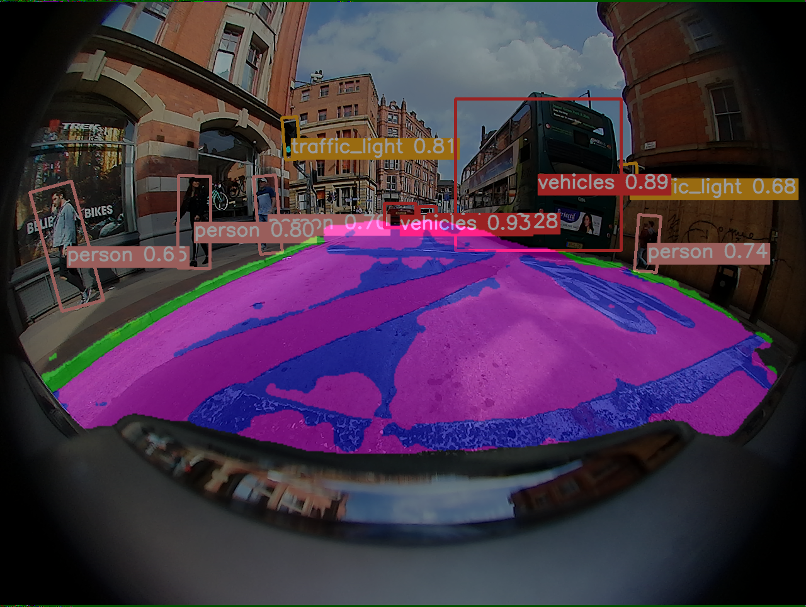

## 基于WoodScape数据集的旋转框目标检测+分割任务

检测结果展示：




上面的结果只做了四类分割：background、road、lanemarks、curb。

只做旋转框目标检测，见之前的版本：https://github.com/renqi1/yolov5_woodscape/tree/v1.0

### 网络结构


### 数据集训练格式

同yolov5标签组织目录一样，额外增加分割标签seglabels, 格式为png图像，前缀与image下的图像名字一一对应。


```
├─ images
│ │── train
│ │── val
├─ labels
│ │── train
│ │── val
├─ seglabels
│ │── train
└─└── val
```

### 较上版本的更改

若要做分割任务，仅需在模型文件添加seg分支（无该分支默认为检测任务），并设置分割类别数cls_seg。


超参数文件可设置分割任务的损失权重：


对于难训练类可修改权重(使用注释的部分)：


预测的时候需要设置类别的colormap:


### 与yolov8_seg的区别
我在做这个的时候恰好yolov8也出了分割模型，v8的分割头构建类似mask rcnn，而本项目的分割头是从FPN上采样后引出,类似Unet的结构。
此外，yolov8的标签与yolov5不兼容，它是多边形标签，而且检测和分割的是同样的物体，感觉任务有点重复。
而本项目则可以在检测模型的基础上再训练分割模型，只要额外提供png分割标签，且灵活度更大，可以实现一些物体做检测，一些物体做分割。
此外，根据需求，可以实现仅做检测任务，水平框+分割，旋转框+分割。


### 参考代码

* [midasklr/yolov5ds](https://github.com/midasklr/yolov5ds)
* [TomMao23/multiyolov5-BS2021](https://github.com/TomMao23/multiyolov5)
* [hukaixuan19970627/yolov5_obb](https://github.com/hukaixuan19970627/yolov5_obb)
* [BossZard/rotation-yolov5](https://github.com/BossZard/rotation-yolov5)
* [ultralytics/yolov5](https://github.com/ultralytics/yolov5)
* [valeoai/WoodScape](https://github.com/valeoai/WoodScape)

### 运行环境

* GPU RTX3090
* ubuntu 20.04.1
* cuda == 11.3
* python == 3.8.13 
* pytorch == 1.10.1 
* transformers==4.21.1   
* numpy==1.22.4
